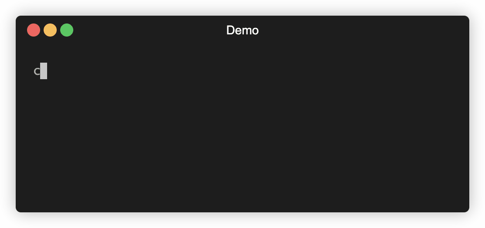

# CLAI - CLI + AI in your terminal

[](LICENSE)




CLAI (CLI + AI = CLAI) allows you to interact with the OpenAI API in your terminal.

## Installation

First, ensure that you have Ruby installed on your system. Then, you can install the gem by running:

```
gem install clai
```

## Configuration

Before using the CLI tool, you need to configure it with your OpenAI API key. You can obtain an API key from the OpenAI website. Once you have your API key, run the following command and provide your key when prompted:

```
clai setup
```

This will create a configuration file (`~/.config/clai/clai.yml`) on your system.

Read more about the setup command [here](docs/setup.md).

## Usage

You can chat with ChatGPT with:

```
// Basic single command
clai chat "Tell me a funny joke"

// Use a preconfigured persona
clai chat "Count to 10" --persona ruby
```

This will send the given prompt to the API and display the generated completion.

Read more about the chat command [here](docs/chat.md).

### Starting a session

You can start an interactive session with `clai session` command.

```
clai session
Your prompt: <Enter your prompt here><Enter>
```

This will start a REPL like process to interact with the OpenAI api.

Read more about the session command [here](docs/session.md).

### Help

To view the available commands and options, you can use the `help` command:

```
clai help
```

This will display a list of supported commands and their descriptions.

## Examples

Here are a few examples to get you started:

```
# Setup clai on your machine
clai setup

# Start an interactive chat session
clai session

# Get help about the available commands and options
clai help

# Send a single prompt
clai chat "Hello World"
```

## Contributing

Please read [CONTRIBUTING.md](CONTRIBUTING.md) for more information.

## Disclaimer

This is alpha software. Make sure to set a billing limit for your api key or unexpected costs will occur.

## License

This project is licensed under the [MIT License](https://opensource.org/licenses/MIT).
